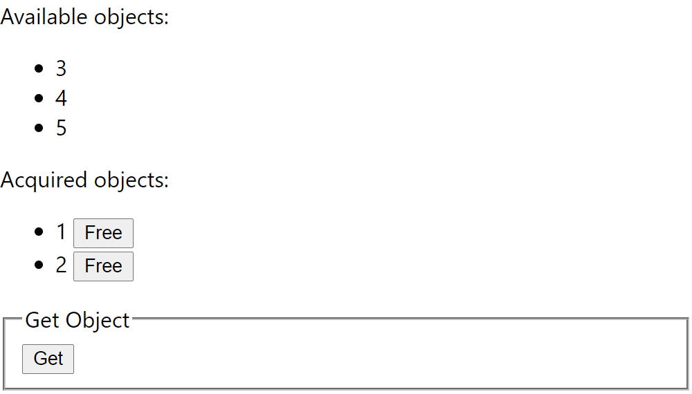

# Object Manager

Object Manager exercise.

<p align="center">
  
</p>

## Design

The Object Manager manages objects which are positive nonzero integers. For the
end user, the object can be in one of two states:

```
+-----------+
| available |-----------+
+-----------+    get    |
      ^                 v
      |   free    +----------+
      +-----------| acquired |
                  +----------+
```

Rules:

- **Get** returns an arbitrary object from the pool. An object cannot be given
  away again unless it has been freed.
- Cannot **Get** an object that is not in the pool.
- **Free** returns the object back into the pool, so that it can be given out
  again.

The REST API allows for concurrent access. The Object Manager uses in-memory
storage, so the state will be lost after the restart.

## Development

1. Start the environment:

   ```sh
   docker-compose up -d env
   ```

2. Start the API server:

   ```sh
   docker-compose exec env env FLASK_APP=api.app flask run -h 0.0.0.0
   ```

4. Start the React dev server:

   ```sh
   docker-compose exec env yarn start
   ```
